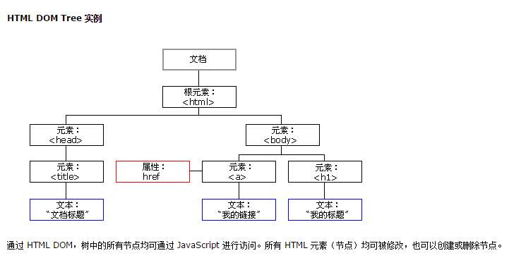
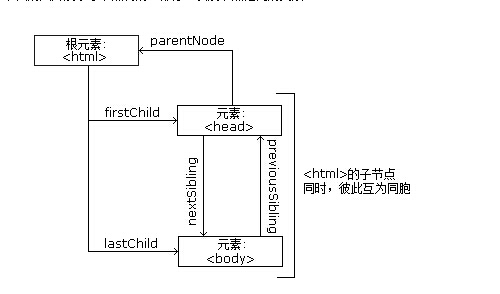

# HTML DOM 节点树



### 节点父、子和同胞

```
<html>
  <head>
    <title>DOM 教程</title>
  </head>
  <body>
    <h1>DOM 第一课</h1>
    <p>Hello world!</p>
  </body>
</html>
```
* 用js来写Html
  document.write("<h1>This is a heading</h1>");
  document.write("<p>This is a paragraph</p>");

* 从上面的 HTML 中：
  <html> 节点没有父节点；它是根节点
  <head> 和 <body> 的父节点是 <html> 节点
  文本节点 "Hello world!" 的父节点是 <p> 节点

* 并且：
  <html> 节点拥有两个子节点：<head> 和 <body>
  <head> 节点拥有一个子节点：<title> 节点
  <title> 节点也拥有一个子节点：文本节点 "DOM 教程"
  <h1> 和 <p> 节点是同胞节点，同时也是 <body> 的子节点

* 并且：
  <head> 元素是 <html> 元素的首个子节点
  <body> 元素是 <html> 元素的最后一个子节点
  <h1> 元素是 <body> 元素的首个子节点
  <p> 元素是 <body> 元素的最后一个子节点

## DOM方法
* getElementById() 方法
  例子 var element=document.getElementById("intro");

* getElementsByTagName 返回指定标签名的元素
  document.getElementsByTagName("p");

* 用js改变html
  x=document.getElementById("demo")  //查找元素
  x.innerHTML="Hello JavaScript";    //改变内容

* getElementsByClassName 返回指定样式名的元素
  document.getElementsByClassName("classname");

* style  修改样式
  x=document.getElementById("demo")  //找到元素
  x.style.color="#ff0000";           //改变样式
  
* 验证
  if isNaN(x) {alert("Not Numeric")};

* appendChild(node) 新增子节点
  var para=document.createElement("p"); //新建一个P标签
  var node=document.createTextNode("This is new.");新建一个文本内容
  para.appendChild(node); P标签里面赋值

  var element=document.getElementById("div1"); //取#di1元素
  element.appendChild(para);  //新增
* html元素中添加事件
  <input type="button" onclick="document.body.style.backgroundColor='lavender';"
  value="Change background color" />

  <script>
  function ChangeBackground()
  {
  document.body.style.backgroundColor="lavender";
  }
  </script>

  <input type="button" onclick="ChangeBackground()"
  value="Change background color" />

* removeChild(node) 删除子节点
  var element=document.getElementById("intro");
  removeChild(element)

* innerHTML 节点（元素）的文本值

* parentNode 节点（元素）的父节点

* childNodes 节点（元素）的子节点

* getAttribute() 节点（元素）的属性节点

* setAttribute()		把指定属性设置或修改为指定的值。

* appendChild() 在指定的子节点前面插入新的子节点。

* nodeValue 返回节点的类型
  x=document.getElementById("intro");
  document.write(x.firstChild.nodeValue);
