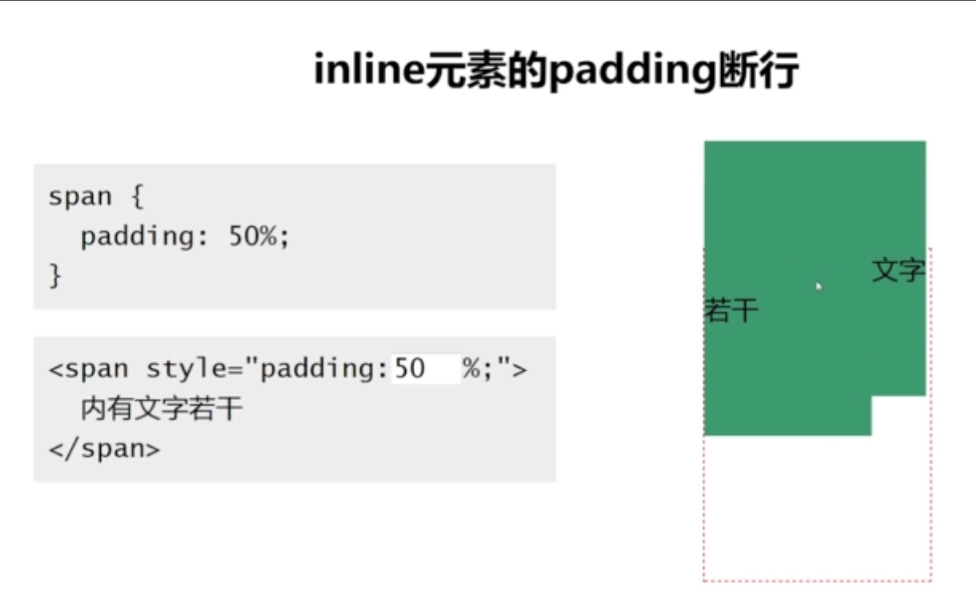

# 常用样式 [demo](demo/demo.html) [文档](http://css.doyoe.com/)

## 尺寸相关
* width 宽
* min-width
* max-width
* height 高
* min-height
* max-height

## margin
普通元素 margin百分比值根据容器宽度计算
绝对定位元素 第一个祖先元素宽度（relative/absolute/fixed）计算

两端对齐
ul margin-right:-20px

等高对齐
父元素overflow:hidden
margin-bottom:-600px;
padding-bottom:600px

## padding
内边距
常用，兼容性好，不激进（中规中矩）

块状元素
padding会影响元素尺寸
padding不支持任何负值
padding百分比根据宽度计算。
1：1的百分比图片都是设置padding50%来搞定。

内链元素
padding会影响元素水平尺寸，
垂直虽然占据占据空间，不过不影响尺寸。
文字会换行

## vertical-align
 行内元素不起作用
inline和inline-block

## display
常见值：
* none
* inline
* inline-block
* block

## 背景相关
* backgroud-color
* background-image
* background-repeat
* background-position
* background-size
* background

## 边框
* border
* border-radius 圆角

## 鼠标相关
* cursor 常用值
  * pointer: 手形
  * default: 默认值：箭头
  * none: 无
  * help: 帮助：问号
  * move: 移动: 十字
  * wait: 等待： loading

## 文字相关
* font-faimly 字体
* font-size 字号大小
* font-weight 字的粗细
* line-height 行高
* color 字的颜色
* font-style
* text-decoration

## 列表(ul 和 ol)相关
* list-style-type 列表项所使用的预设标记
* list-style-postion

## 其他
* opacity 透明度

## 常用单位
尺寸单位有： px，em，rem，deg,百分比。

## 颜色值
* 颜色名称: white, black, red ...
* 十六进制: #ff00ff (#红绿蓝)
* rgb 和 rgba: rgb(255, 0, 255), rgba(255, 0, 0, .5)
